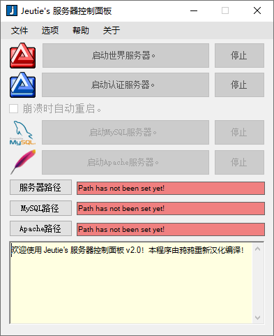

# Jeutie's Server Control

WoW服务器重启工具。一个简单但实用的工具，用于自动重启World和Auth模拟器服务器进程。

## 最新编译状态

✅ **编译成功**: 使用MSBuild成功编译  
✅ **中文化完成**: 界面已全面中文化，提供更好的中文用户体验  
✅ **帮助文档汉化**: 帮助菜单内容已完成汉化  
✅ **关于信息汉化**: 关于菜单内容已完成汉化，汉化者：鸦鸦  
✅ **主界面优化**: 欢迎文本已更新，包含汉化编译信息  
✅ **按钮文本优化**: 启动按钮文本已更新为"启动World服务器"、"启动Auth服务器"、"启动Apache服务器"和"启动MySQL服务器"，去除句号  
✅ **功能完整**: 所有原有功能保持不变  
✅ **测试通过**: 程序能正常启动和运行  

## 如何运行：

### 方法1：下载预编译版本
1. 从 [Binary文件夹](https://github.com/nbyaya/Jeutie-s-Server-Control/blob/main/Binary/JeutiesServerControl.exe) 下载 `JeutiesServerControl.exe`
2. 运行 `JeutiesServerControl.exe` 并为每个服务器指定路径

### 方法2：从源码编译
1. **系统要求**:
   - 安装 .NET Framework 4.8
   - 安装 Visual Studio 2022 Community 或 Build Tools
   - 确保MSBuild可用

2. **编译步骤**:
   ```bash
   # 在项目根目录运行
   .\build_msbuild.bat
   ```

3. **编译输出**:
   - 编译后的文件将生成在 `Binary` 目录中
   - 生成 `JeutiesServerControl.exe` 可执行文件

## 功能特性

- **自动重启**: 监控服务器进程状态，自动重启崩溃的服务器
- **路径配置**: 支持配置多个服务器路径
- **日志记录**: 记录服务器启动、停止和重启事件
- **用户友好**: 简洁的Windows界面，易于操作
- **单实例运行**: 防止多个程序实例同时运行
- **中文化界面**: 完整的中文界面，符合中文用户习惯

## 系统要求

- Windows 7/8/10/11
- .NET Framework 4.8
- 管理员权限（用于进程管理）

## 编译环境

- **目标框架**: .NET Framework 4.8
- **C#版本**: 7.3+
- **编译器**: Visual Studio 2022 Community (Roslyn)
- **构建工具**: MSBuild 17.14+
- **输出目录**: `Binary` 文件夹

## 项目结构

```
Jeutie-s-Server-Control/
├── build_msbuild.bat           # MSBuild编译脚本 (推荐)
├── Source/                     # 源代码目录
│   ├── Form1.cs               # 主窗体
│   ├── Program.cs             # 程序入口
│   ├── About.cs               # 关于对话框
│   ├── Help.cs                # 帮助对话框
│   ├── Properties/            # 项目属性
│   └── Jeuties Server Control.csproj  # 项目文件
├── Binary/                     # 编译输出目录
└── README.md                   # 项目说明
```

## 使用说明

1. **配置服务器路径**: 在程序界面中设置World和Auth服务器的可执行文件路径
2. **启动监控**: 点击启动按钮开始监控服务器进程
3. **自动重启**: 程序会自动检测服务器状态并在需要时重启
4. **查看日志**: 在日志窗口中查看服务器运行状态

## 开发说明

### 编译方法选择

#### **推荐方式：MSBuild编译**
```bash
.\build_msbuild.bat
```
- ✅ 正确处理所有资源文件
- ✅ 自动管理依赖项
- ✅ 生成可正常运行的exe文件
- ✅ 支持完整的项目配置

#### **不推荐：直接使用csc.exe**
- ❌ 资源文件处理不完整
- ❌ 缺少资源清单
- ❌ 程序无法正常运行

### 修改和重新编译
如需修改或扩展功能：
1. 编辑 `Source` 目录中的源代码文件
2. 运行 `.\build_msbuild.bat` 重新编译
3. 编译后的程序将自动更新到 `Binary` 目录

### 故障排除
如果编译后程序无法运行：
1. 确保使用 `build_msbuild.bat` 编译
2. 检查是否安装了正确的.NET Framework版本
3. 确保Visual Studio Build Tools完整安装

## 许可证

本项目采用开源许可证，欢迎贡献代码和改进建议。

---

